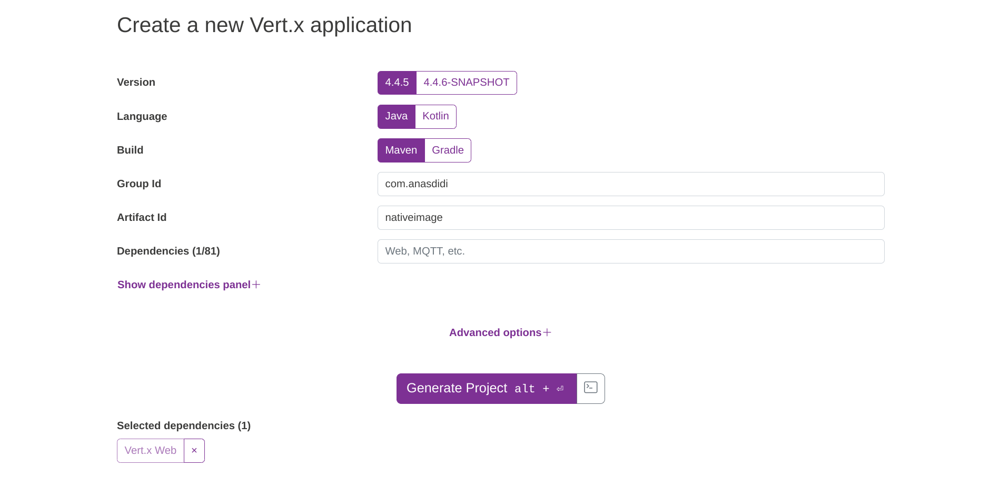

GraalVM Native Image is a native executable with optimized translation of Java application which includes only the core required at run time.
The executable has several advantages, such as
- Faster startup times
- (Usually) smaller package and heap size

Vert.x is a tool-kit for building reactive Java application rather than full-features framework.
Thus, Vert.x is suitable candidate to build native image as native image compilation has several restrictions which most not apply to Vert.x core code.

Below are the steps on how to build GraalVM Native Image with Vert.x and Docker.

---

## Steps

Following are the list of tools need for the project:
- Docker
- Maven (or Gradle)

### 1. Create a new Vert.x application

Create a new Vert.x applicaton using [Vert.x App Generator](https://start.vertx.io/).

Make note the **Group Id** and **Artifact Id** when create the application.
In this example, following are the values used for both:
- **Group Id**: com.anasdidi
- **Artifact Id**: nativeimage


*Figure 01: Vert.x Starter - Create a new Vert.x application*
<br/>
<br/>

Then, create a simple Hello World Vert.x application.
```java
package com.anasdidi.nativeimage;

import io.vertx.core.AbstractVerticle;
import io.vertx.core.Promise;

public class MainVerticle extends AbstractVerticle {

  @Override
  public void start(Promise<Void> startPromise) throws Exception {
    vertx.createHttpServer().requestHandler(req -> {
      req.response()
        .putHeader("content-type", "text/plain")
        .end("Hello from Vert.x!");
    }).listen(8888, http -> {
      if (http.succeeded()) {
        startPromise.complete();
        System.out.println("HTTP server started on port 8888");
      } else {
        startPromise.fail(http.cause());
      }
    });
  }
}
```

### 2. Setup GraalVM config files

Create a new folder in path:

`src/main/resources/META-INF/native-image/<Group Id>/<Artifact Id>`.

In this case, the created folder will be:

**src/main/resources/META-INF/native-image/com.anasdidi/nativeimage**.

Next, create these files in the folder:
- jni-config.json
- native-image.properties
- reflect-config.json
- resource-config.json

```json
[]
```
*META-INF/native-image/com.anasdidi/nativeimage/jni-config.json*
<br/>
<br/>

```properties
Args =\
--enable-http \
--enable-https \
-H:EnableURLProtocols=http,https \
--report-unsupported-elements-at-runtime \
-H:ReflectionConfigurationResources=${.}/reflect-config.json \
-H:JNIConfigurationResources=${.}/jni-config.json \
-H:ResourceConfigurationResources=${.}/resource-config.json \
--initialize-at-run-time=io.netty.handler.codec.compression.ZstdOptions \
-H:+PrintClassInitialization \
-H:+ReportExceptionStackTraces
```
*META-INF/native-image/com.anasdidi/nativeimage/native-image.properties*
<br/>
<br/>

```json
[
  {
    "name": "io.vertx.core.impl.launcher.commands.RunCommand",
    "allDeclaredConstructors": true,
    "allDeclaredMethods": true
  },
  {
    "name": "io.vertx.core.impl.launcher.commands.VertxIsolatedDeployer",
    "allDeclaredConstructors": true,
    "allDeclaredMethods": true
  },
  {
    "name": "java.lang.Long",
    "allDeclaredConstructors": true
  },
  {
    "name": "java.lang.Integer",
    "allDeclaredConstructors": true
  },

  {
    "name": "com.anasdidi.nativeimage.MainVerticle",
    "allDeclaredConstructors": true,
    "allDeclaredMethods": true
  }
]
```
*META-INF/native-image/com.anasdidi/nativeimage/reflect-config.json*

Replace `"name": "com.anasdidi.nativeimage.MainVerticle"` with respective Group Id and Artifact Id.
<br/>
<br/>

```json
{
    "resources": {
      "includes": [
        {"pattern": "META-INF/com.anasdidi.nativeimage.*"}
      ],
      "excludes": [
      ]
    }
  }
```
*META-INF/native-image/com.anasdidi/nativeimage/resource-config.json*

Replace `{"pattern": "META-INF/com.anasdidi.nativeimage.*"}` with respective Group Id and Artifact Id.
<br/>
<br/>

Below are the structure of the folders and files for the setup.
```bash
├── pom.xml
├── src
│   ├── main
│   │   ├── java
│   │   │   └── com
│   │   │       └── anasdidi
│   │   │           └── nativeimage
│   │   │               └── MainVerticle.java
│   │   └── resources
│   │       └── META-INF
│   │           └── native-image
│   │               └── com.anasdidi
│   │                   └── nativeimage
│   │                       ├── jni-config.json
│   │                       ├── native-image.properties
│   │                       ├── reflect-config.json
│   │                       └── resource-config.json
```

---

## References

* [Native Image](https://www.graalvm.org/latest/reference-manual/native-image/)
* [Building a Vert.x Native Image](https://how-to.vertx.io/graal-native-image-howto/)
