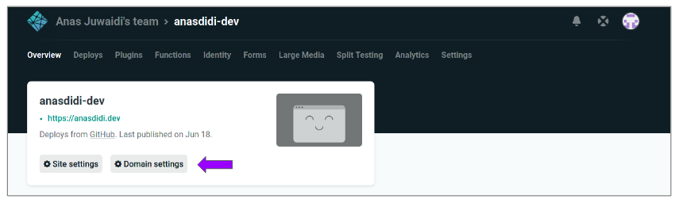
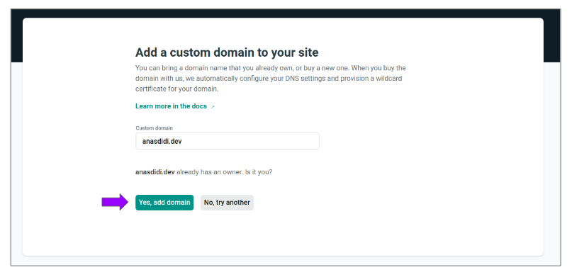
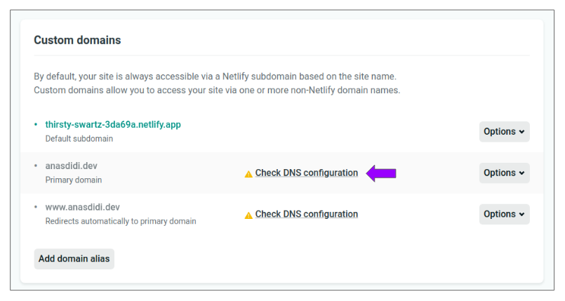

By default, any site deployed to Netlify will be provide with Netlify subdomain using the following template: `[site-name].netlify.app`

However, if we already have an external registered domain from other provider such as GoDaddy, we can configure the DNS provider to point to your domain to Netlify.

Following guide will provide on how to configure DNS from GoDaddy to point to Netlify.

---

## Table of contents
* [Domain Settings in Netlify](#domain-settings-netlify)
* [DNS Configuration](#dns-configuration)
* [References](#references)

---

## Domain Settings in Netlify
Login to Netlify Dashboard, open your project and click **Domain settings**.

Add click **Add domain alias** under **Custom domains** box.

Next, enter the domain registered with GoDaddy and click **Yes, add domain** to confirm the domain verification.

---

## DNS Configuration

After added, Netlify will try to propagate the DNS changes with GoDaddy. To continue, click **Check DNS configuration** for details required for GoDaddy configuration.

---

## References

* [Custom Domains in Netlify](https://serverless-stack.com/chapters/custom-domain-in-netlify.html)
* [Configure external DNS for a custom domain](https://docs.netlify.com/domains-https/custom-domains/configure-external-dns/#configure-a-subdomain)

