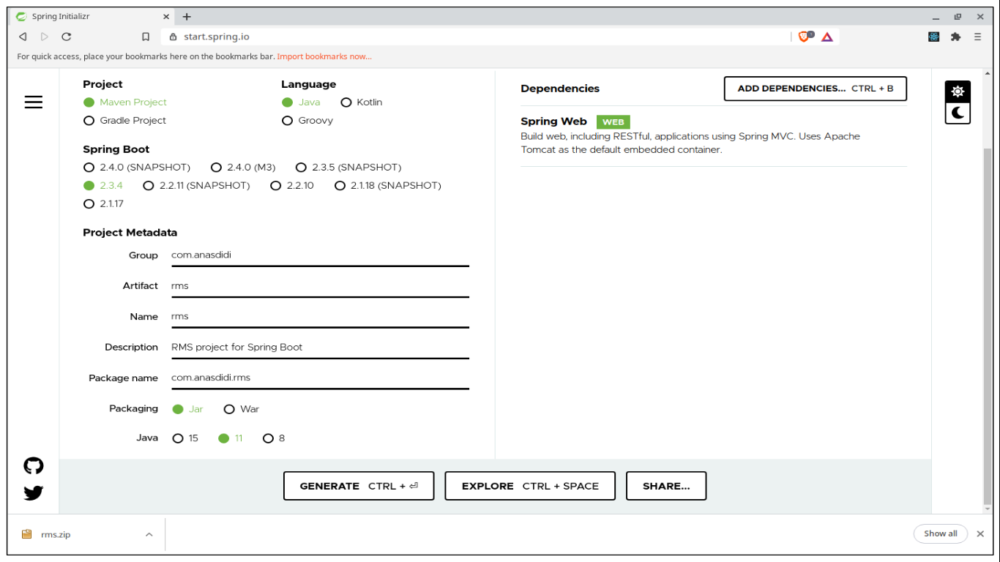

**Spring Boot** packaging model enables us to package the application into a standalone application. Combine with **Heroku** to deploy the application, it will make deployment more easier compared to traditional Java application deployment.

Heroku is a cloud platform that lets companies build, deliver, monitor and scale apps. Heroku makes the processes of deploying, configuring, scaling, tuning, and managing apps as simple and straightforward as possible, so that developers can focus on what’s most important: building great apps that delight and engage customers.

Therefore, using Heroku not only make it easier for deployment, it also provides tool for us to maintain and monitor the application.

Following is the guide on how to deploy Spring Boot application with Heroku using Github as deployment method.

---

## Table of contents
* [Generate project](#generate-project)
* [Create Web Controller](#create-web-controller)
* [References](#references)

---

<a name="generate-project"></a>
## Generate project

First, we need to generate Spring Boot project. And the easier way to do this is by using **[Spring Initializr](https://start.spring.io/)** website. Spring Initializr is a web-based tool provided by Pivotal Web Service to help generating Spring Boot project within clicks.


*Figure 01: Spring Initializr website interface*

In the website, we can setup the project components such as package management, language, metadata and dependency. Thus, the website offers a fast way to pull in all the dependencies we need for an application and does a lot of the setup for us.

This sample project will add **Spring Web** for the dependency.

---

<a name="create-web-controller"></a>
## Create Web Controller

Next, we are going to create sample controller for the application. This controller allows us to submit HTTP requests into the application and get the result back.

In Spring Boot, we annotate the class with `@Controller` or `@RestController` to identify it as controller. 
* `@Controller` is used to mark class as Spring MVC controller which allows us to return a view (e.g. HTML) as response. 
* `@RestController` is convenience annotation for both `@Controller` and `@ResponseBody` which allows us to convert response to JSON/XML automatically.

In the sample, **HelloController** handles **GET** request for **/hello** which will return a String as response.

```java
package com.anasdidi.rms.controller;

import org.springframework.http.ResponseEntity;
import org.springframework.web.bind.annotation.RequestMapping;
import org.springframework.web.bind.annotation.RequestMethod;
import org.springframework.web.bind.annotation.RestController;

@RestController
public class HelloController {

  @RequestMapping(value = "/hello", method = RequestMethod.GET)
  public ResponseEntity<String> getGreeting() {
    return ResponseEntity.ok().body("Hello World");
  }
}
```

Then, we can test the controller in local environment by using **cURL** to send request to **http://localhost:8080/hello**.

```bash
$ curl --request GET --url http://localhost:8080/hello
Hello World
```

Now the sample application is ready to be deployed into Heroku.

---

<a name="references"></a>
## References

* [What is Heroku; heroku.com](https://www.heroku.com/what)
* [Spring Initializr; spring.io](https://start.spring.io/)

